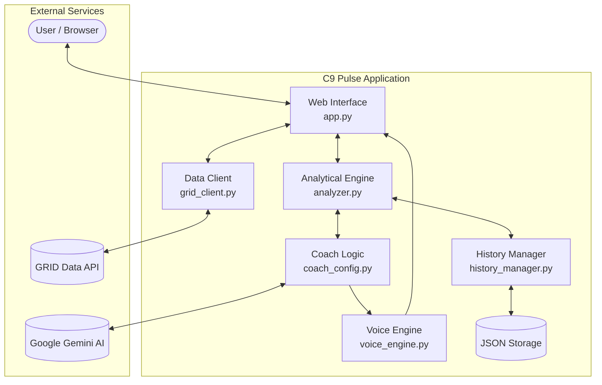

# C9-Pulse Project Architecture

C9-Pulse is an analytical platform for real-time monitoring and analysis of Valorant matches, using data from the GRID API. The system provides deep analytics of player performance, team economy, and provides advice from a virtual coach.

## Core Components

### 1. Web Interface (Flask) — `app.py`
The central hub of the application provides:
- Displaying a list of recent matches and tournaments.
- Detailed view of a specific match with analytical insights.
- Interactive chat with the "Coach".
- Routing requests to other modules.

### 2. Data Client (GRID API) — `grid_client.py`
Module for interacting with the GRID API via GraphQL:
- Fetching a list of tournaments and series (matches).
- Loading detailed series state (`seriesState`) for real-time analysis.
- Handling authentication and executing requests.

### 3. Analytical Engine — `analyzer.py`
The core of the system is responsible for interpreting raw match data:
- **Performance Analysis:** calculation of K/D, trade efficiency.
- **Economy Analysis:** economic risk assessment, purchase recommendations.
- **Psychological Analysis:** identifying player "tilt" risk based on consecutive deaths and other metrics.
- **Strategy Analysis:** identifying opponent strategies and critical match moments.

### 4. History Manager — `history_manager.py`
Responsible for local data storage:
- Saving match analysis results to `match_history.json`.
- Calculating long-term player statistics (average K/D, first blood frequency).

### 5. Voice Engine — `voice_engine.py`
Provides "voice-over" for coach comments:
- Using `edge-tts` to generate speech from text.
- Automatic cleanup of old audio files in `static/audio/`.

### 6. Coach Configuration — `coach_config.py`
Virtual coach personality setup:
- Integration with Google Gemini AI for generating contextual chat responses.
- Phrase templates for various game situations (ace, clutch, poor economy).

## System Diagram

## Technology Stack

- **Backend:** Python, Flask
- **AI/LLM:** Google Gemini (via `google-genai`)
- **API:** GRID Data API (GraphQL)
- **TTS:** Edge-TTS
- **Frontend:** HTML5, CSS3, JavaScript (Vanilla)
- **Storage:** JSON (local files)

## Key Design Decisions

- **Hybrid AI Approach:** We combine rule-based heuristics (in `analyzer.py`) for instant metric calculations with Generative AI (Gemini) for contextual coaching. This ensures low latency for real-time updates while maintaining the depth of LLM insights.
- **Edge-TTS for Voice:** Selected `edge-tts` over standard `gTTS` to utilize high-quality Neural voices ("GuyNeural") without requiring additional paid API keys or complex cloud setups, ensuring the project remains accessible and easy to deploy.
- **Resilient Data Handling:** The `GridClient` implements robust error handling and structure normalization to deal with the complexities of the live GraphQL feed.

## Data Flow

1. **Data Request:** `app.py` or `main.py` requests match data through `grid_client.py`.
2. **Analysis:** The received data is passed to `MatchAnalyzer`.
3. **Processing:** `MatchAnalyzer` calculates metrics and generates a report.
4. **Enrichment (AI):** If coach advice is required, data or questions are passed to `coach_config.py` (Gemini).
5. **Voice-over:** The generated commentary text can be turned into an audio file via `voice_engine.py`.
6. **Storage:** Analysis results are saved through `history_manager.py` for subsequent use in statistics.
7. **Display:** The resulting data is rendered in Flask templates (`templates/`) and delivered to the user.

## File Structure

- `app.py` — Main web application file.
- `grid_client.py` — Client for GRID API.
- `analyzer.py` — Match analysis logic.
- `history_manager.py` — Working with JSON history.
- `voice_engine.py` — Speech generation.
- `coach_config.py` — AI Coach settings.
- `static/` — CSS, JS, and generated audio files.
- `templates/` — HTML templates (Jinja2).
- `match_history.json` — History database (local).
