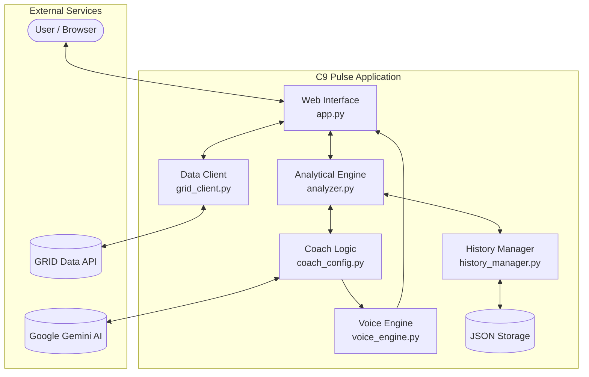

# C9 Pulse: The AI Assistant Coach 🌩️

[](https://devpost.com/software/c9-pulse-the-ai-morale-coach)
[](https://github.com/vero-code/c9-pulse)
[](https://www.python.org/)
[](https://github.com/astral-sh/uv)
[](https://grid.gg/)
[](https://www.jetbrains.com/ai/)

> **"Moneyball with a Heart"** — An intelligent analytical engine that combines real-time strategic insights with psychological support for Valorant players.

---

## 🎨 Visual Experience

Moved away from the console-only interface to a full-featured **Web Dashboard** built with **Flask**.

### ⚡ Key UI Features:
* **Dark Mode (Cloud9 Style):** A sleek, professional interface using C9's signature black, blue, and white colors.
* **Header & Footer:** Streamlined layout with dynamic branding and match context.
* **Visual Polish:** Added team logos and brand colors to API responses for better immersion.
* **Scouting Info:** Real-time "Win Streak" and Winrate tracking for all teams.
* **Interactive Dashboard:** Real-time statistics, match history with UTC datestamps.
* **Match Detail:** AI-driven insights, Live Coaching, and Coach Chat.
* **Visual Progress Bars:** K/D performance visualized through dynamic progress bars.
* **Team Economy Graph:** A live line chart showing team economy trends across rounds.
* **Thinking Indicator:** A visual "thinking" state for the AI coach, so you know when insights are being generated.
* **Actionable UX:** "Start Analysis" button with a loading spinner for a smooth experience.
* **Enhanced Player Cards:** Large, readable names with detailed metrics, optimized to prevent data overflow in headers.

---

## 🧠 Advanced Analytics (Moneyball "Brain")

The core engine has been upgraded with deep analytical metrics (v0.3.0):

* **Economic Risk Assessment:** AI calculates the risk of losing the current round based on player K/D and team economy.
* **Purchasing Advice:** Real-time recommendations on when to "Save", "Force Buy", or "Full Buy".
* **Tilt Meter:** Detects psychological instability in players by analyzing death streaks and sudden performance drops.
* **Opponent Analysis:** Identifies enemy playstyles (aggressive vs. passive) and highlights their most dangerous players.
* **Match MVP & Underperformer:** Automatically highlights the top-performing player with a **Gold Frame** and flags struggling teammates for targeted support.
* **Match History Persistence:** All analyzed matches are saved to `match_history.json` for long-term tracking.
* **Historical K/D Comparison:** Compare current performance (`Current K/D`) against the player's historical average (`Avg K/D`).
* **Trade Efficiency Metric:** Measures how effectively players are traded during exchanges.

---

## 🎙️ Live AI Coach

C9 Pulse now features a "voice" with a distinct personality to keep the team focused, now integrated with **Google Gemini** for real-time coaching.

* **Coach Marcus 'Titan' Vance:** A strict but fair veteran personality who provides feedback based on match events.
* **Live AI Coaching:** Replaced **static rule-based responses** with a live integration of Google Gemini API. The coach now generates dynamic strategy advice based on the match context, rather than using pre-set templates.
* **Voice Synthesis:** Powered by **edge-tts** for high-quality, natural-sounding voice commentary.
* **Adaptive Feedback:**
    * **Praise:** Dynamic phrases for Aces, clutches, and high K/D.
    * **Emotional Support:** Calming "Down Phrases" to prevent tilt after tough losses.
    * **Critical Alerts:** Only the most important moments (Aces, Death Streaks, Economy Shifts) are voiced to avoid distraction.
    * **Routine Updates:** Added "standard phrases" to keep the flow when no major events occur.
* **Timeout Talk Mode:** A comprehensive mid-match strategy breakdown provided during breaks.
* **Interactive Text Chat:** Talk directly to Coach Titan to get specific advice or performance updates.
* **Mute Coach Toggle:** Full control over audio feedback with a dedicated mute button.

---

## 📺 Demo Video

[](https://www.youtube.com/watch?v=Y7r9F2NEKbQ)

*(Click the image to watch the live demo)*

---

## 🏗️ Architecture

C9 Pulse is designed as a modular analytical platform. Below is a high-level overview of the system's data flow and components.



For a more detailed technical breakdown, please refer to the [ARCHITECTURE.md](ARCHITECTURE.md) file.

---

## 🧪 Quality Assurance

Focused heavily on code quality and performance:

*   **Unit Testing:** Comprehensive test suite added for core modules (`analyzer.py`, `grid_client.py`, `history_manager.py`, `voice_engine.py`) using `pytest`.
*   **Performance Optimization:** Refactored `MatchAnalyzer` to use hash maps for data processing, significantly reducing complexity in heavy data loops.
*   **Type Safety:** Implemented static type hinting across all core modules for better maintainability and IDE support.
*   **Documentation:** Comprehensive docstrings added to all business logic functions to aid future development.
*   **Modern Tooling:** Migrated the project from `pip` to `uv` for lightning-fast dependency management and reproducible builds.

---

## 🏆 Packaging

To ensure judges and developers can run the project without any friction (v0.4.0):

*   **One-Command Setup:** Using `uv sync` ensures a perfectly reproducible environment in seconds.
*   **Standard Compatibility:** A `requirements.txt` file is automatically generated and kept up-to-date for those using standard `pip`.
*   **Modular Scripts:** JavaScript logic for the dashboard has been moved to separate files (`static/js/`) for cleaner project structure.
*   **Assets:** Added favicon and brand assets to complete the professional look.

---

## 🛠️ Tech Stack

* **Data Source:** [GRID Open Platform API](https://grid.gg/platform) (GraphQL)
* **IDE:** PyCharm (JetBrains IDE)
* **AI Co-Pilot:** Junie (JetBrains AI Agent)
* **Frontend:** HTML5, CSS3 (Custom C9 Theme), Bootstrap 5, Chart.js
* **Backend:** Flask (Python)
* **AI Engine:** Google Gemini (Live Coaching)
* **Voice:** `edge-tts` (Microsoft Edge Text-to-Speech)
* **Storage:** JSON-based persistence
* **Package Manager:** [uv](https://github.com/astral-sh/uv)

---

## 🚀 How to Run

### Prerequisites

-   Python 3.9 or higher
-   A GRID Open Platform API Key

### Setup

1.  **Clone the repository**

    ```bash
    git clone https://github.com/vero-code/c9-pulse.git
    cd c9-pulse
    ```
    
2.  **Install dependencies**

    Using `uv` (recommended):
    ```bash
    uv sync
    ```
    
    Using `pip` (standard):
    ```bash
    pip install -r requirements.txt
    ```
    
3.  **Configure Environment** Create a `.env` file in the root directory and add your keys:

    ```env
    GRID_API_KEY=your_actual_api_key_here
    GEMINI_API_KEY=your_gemini_api_key_here
    ```
    
4.  **Run the Web Dashboard**

    Using `uv`:
    ```bash
    uv run app.py
    ```
    Using `python`:
    ```bash
    python app.py
    ```
    Open `http://127.0.0.1:5000` in your browser.

---

## 🧩 Technical Deep Dive

### The "Live Data" Breakthrough
One of the biggest technical challenges was accessing granular player statistics (Kills/Deaths) via the standard Open Platform API. The default `central-data` endpoint provided only schedule information.

**How I solved it:**
Using **Junie (JetBrains AI)**, I reverse-engineered the query structure and identified the access point for the **Live Data Feed** (`series-state`). 
I wrote a custom GraphQL client in Python that bypasses the static data limitations, fetching real-time game states directly.

```graphql
# Example of the Live Data Query utilized
query GetSeriesState($id: ID!) {
  seriesState(id: $id) {
    games {
      teams {
        players {
          name
          kills  # Accessed via flat structure
          deaths
        }
      }
    }
  }
}
```

---

## 🔮 Future Roadmap

- [x] **Flask Web Dashboard:** Visual dashboard for economy graphs and stats.
- [x] **Voice Synthesis (TTS):** Coach personality with real-time audio commentary.
- [x] **Gemini Integration:** Live AI coaching based on real-time match state.
- [x] **Unit Testing:** Comprehensive coverage for core logic.
- [ ] **Predictive Models:** Using historical data to predict enemy eco-rounds.
- [ ] **Advanced Tactical Overlay:** Real-time map positioning advice.

---

## 🤝 Acknowledgments

-   **JetBrains & Cloud9:** For hosting the "Sky's the Limit" Hackathon.
-   **Junie:** For being an incredible pair programmer, debugger, and schema decoder.
-   **GRID:** For providing the esports data infrastructure.

---

## 📝 License

This project is licensed under the MIT License - see the [LICENSE](LICENSE) file for details.

---

*Built with 💙 by vero-code*